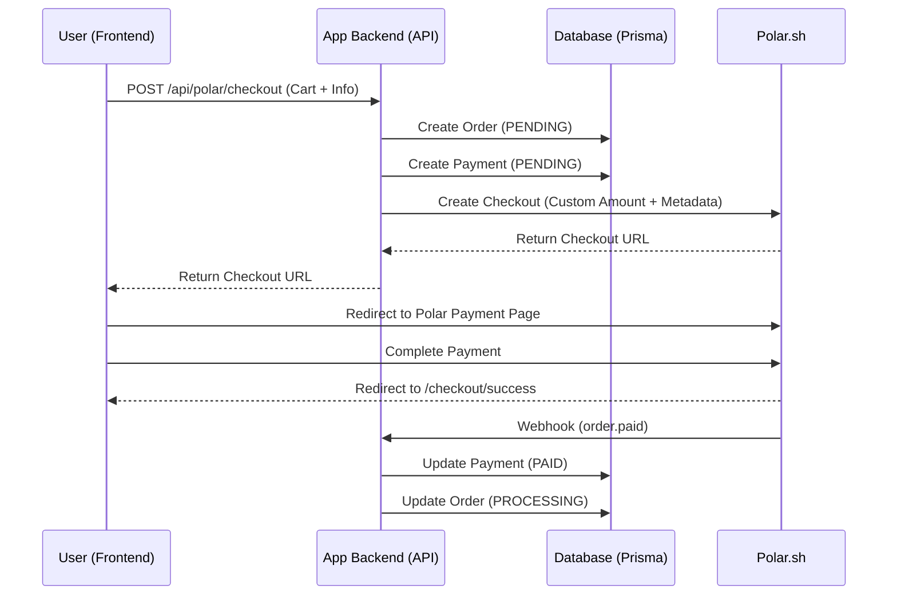
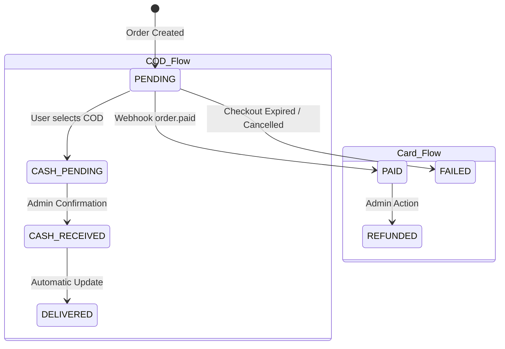

# Payments Feature Documentation

This document outlines the implementation of the payment system in the Abaz Exclusive application, featuring a dual-method approach: online card payments via Polar.sh and Cash on Delivery (COD).

## 1. Overview

The payment system is designed to be flexible, supporting both automated online payments and manual cash-based transactions. It leverages **Polar.sh** as the primary payment processor for card payments while maintaining a custom internal workflow for COD orders.

### Key Integration Strategy: Hybrid Dynamic Payments
We do NOT mirror products in Polar. Instead, we use a **Generic Product** in Polar with dynamic price overrides. This allows us to:
- Handle any cart total without pre-defined products in the Polar dashboard.
- Pass rich metadata (product lists, user IDs, delivery notes) to Polar for display in their dashboard and retrieval via webhooks.
- Support multiple currencies (MKD, USD, EUR) with real-time exchange rates.

---

## 2. Technical Architecture & Flows

### 2.1 Checkout Sequence Diagram
The following diagram illustrates the interaction between the User, App Backend, and Polar.sh for Card Payments.



### 2.2 Payment State Transitions
Tracking the status of a payment from initiation to fulfillment.



---

## 3. UI Component Architecture

The payments UI is divided into user-facing checkout, user management, and admin management.

### 3.1 Component Tree
```text
src/
├── app/
│   ├── (public)/checkout/
│   │   └── CheckoutPageClient.tsx (Main Flow)
│   │       ├── CartSummary.tsx
│   │       └── (Action Buttons: Card/COD)
│   ├── (protected)/dashboard/payments/
│   │   ├── UserPaymentTable.tsx
│   │   └── [id]/UserPaymentDetailView.tsx
│   └── (admin)/admin-dashboard/payments/
│       ├── AdminPaymentTable.tsx
│       ├── PaymentAnalyticsDashboard.tsx
│       └── [id]/AdminPaymentDetailView.tsx
└── components/payments/ (Shared)
    ├── PaymentStatusBadge.tsx (Universal status indicator)
    ├── PaymentMethodIcon.tsx (Icons for Card/Cash)
    ├── PaymentTimeline.tsx (Audit trail)
    ├── PricingBreakdown.tsx (Detail view pricing)
    └── ProductDetailCard.tsx (Individual item card)
```

### 3.2 Key UI Implementation Details

#### **The Checkout Strategy (`CheckoutPageClient.tsx`)**
*   **Dual-Action Buttons**: Instead of a "Select Method" radio list, the UI uses distinct buttons: "Continue to Payment" (Card) and "Place Order (COD)". This reduces friction and makes the next step clear.
*   **Loading States**: Uses comprehensive **Loading Skeletons** (`h-10 animate-pulse`) to prevent layout shift while fetching cart or user data.
*   **Validation**: Zod-based validation on the client ensures address, email, and phone are present before initiating any payment request.

---

## 4. Admin Payments Management (`AdminPaymentTable.tsx`)

The Admin Dashboard provides a powerful interface for overseeing all transactions and performing manual overrides.

### 4.1 Features
- **Global Search**: Search by Payment ID, Order ID, Customer Name, or Email.
- **Advanced Filters**: Filter by Payment Method (Card, COD) and Status (Pending, Paid, Failed, Cash Pending).
- **Column Visibility**: Customize the table view by toggling columns (Provider, Created Date, etc.).
- **Mobile Optimization**: Automatically switches to a touch-friendly **Card-based layout** on mobile devices, ensuring all critical data and actions are accessible on small screens.

### 4.2 Admin Actions
- **Sync with Polar**: Manually trigger a status check for a Card payment to reconcile with the Polar API.
- **Force Confirm as Paid**: A safety override for Polar payments if a webhook fails but the payment is verified manually.
- **Confirm Cash Payment**: Transition a COD order from `CASH_PENDING` to `CASH_RECEIVED`.
- **Process Refund**: Process total or partial refunds for completed payments.

---

## 5. User Dashboard Payments (`UserPaymentTable.tsx`)

The User Dashboard allows customers to track their own payment history and download receipts.

### 5.1 Features
- **Visual Order Identification**: Shows product thumbnails directly in the table/card row for instant identification.
- **Detailed Status**: Uses the `PaymentStatusBadge` to provide clear, color-coded explanations of current payment status.
- **Mobile-First Experience**: Optimized using a responsive card layout that prioritizes the Order ID, Status, and Amount.

### 5.2 User Actions
- **View Details**: Access a full itemized breakdown of the order and its pricing.
- **Download Receipt**: One-click download for receipts of completed (`PAID` or `CASH_RECEIVED`) payments.

---

## 6. Payment Analytics (`PaymentAnalyticsDashboard.tsx`)

A comprehensive dashboard for monitoring financial performance and payment health.

### 6.1 Key Metrics
- **Total Revenue**: Sum of all successful payments in MKD.
- **Success Rate**: Percentage of successful vs. failed/cancelled payment attempts.
- **Average Payment Amount**: Calculated across all successful transactions.
- **Growth Rate**: Month-over-month comparison of revenue and transaction volume.

### 6.2 Visual Analysis
- **Revenue by Method**: Comparison of Card vs. Cash on Delivery revenue.
- **Payment Method Performance**: Success/Failure/Pending breakdown for each available method.
- **Status Distribution**: Real-time view of the order pipeline (Paid, Processing, Pending, Refunded).

---

## 7. Exchange Rate Management (`ExchangeRateService.ts`)

The application implements a robust multi-currency system with automated rate fetching and fallback safety.

### 7.1 Core Logic
- **Base Currency**: MKD (Macedonian Denar).
- **Supported Targets**: USD, EUR.
- **Fetch Strategy**: The system attempts to resolve rates in the following order:
    1.  **Local Database**: Uses active rates if they are less than 24 hours old.
    2.  **External API**: Fetches from `@fawazahmed0/currency-api` with a fallback to `latest.currency-api.pages.dev`.
    3.  **Expired Cache**: Uses the latest available rate in the DB if the API is unreachable.
    4.  **Hardcoded Fallback**: Last-resort rates stored in the code (Updated: Dec 2025).

### 7.2 Storage & Refresh
- **Data Model**: The `ExchangeRate` model tracks `baseCurrency`, `targetCurrency`, `rate`, `fetchedAt`, and `isActive`.
- **Auto-Refresh**: Rates are automatically refreshed upon the first request after expiry (24-hour TTL).
- **Admin Control**: Admins can force a manual refresh through the `/admin-dashboard/exchange-rates` interface and view historical rate data to monitor currency stability.

---

## 8. Service Layer & Data Handling

### 8.1 Metadata Schema
When creating a Polar checkout, we pass a flattened metadata object. This is critical for data integrity if the local database record is ever out of sync.

| Key | Value | Purpose |
| :--- | :--- | :--- |
| `orderId` | `uuid` | Maps back to our local Order table |
| `userId` | `uuid \| 'guest'` | Links to User account if authenticated |
| `cartItems` | `JSON String` | Fallback list of items for the receipt |
| `productSummary`| `String` | Human-readable list for Polar Dashboard (e.g., "iPhone (1x), Case (2x)") |

---

## 9. Configuration & Environment Variables

Required environment variables for the payment system:

```env
# Polar.sh
POLAR_ACCESS_TOKEN=polar_oat_...
POLAR_WEBHOOK_SECRET=polar_whs_...
POLAR_ENVIRONMENT=sandbox # or production
POLAR_GENERIC_PRODUCT_ID=... # ID of the product used for dynamic pricing

# App URLs
NEXT_PUBLIC_APP_URL=http://localhost:3000
POLAR_SUCCESS_URL=${NEXT_PUBLIC_APP_URL}/checkout/success
POLAR_CANCEL_URL=${NEXT_PUBLIC_APP_URL}/checkout/cancel
```

---

## 10. Implementation Files Reference

| File | Responsibility |
| :--- | :--- |
| `src/services/payment.ts` | Database operations, order/payment sync, COD confirmation. |
| `src/services/polar.ts` | SDK wrapper, checkout creation, metadata flattening. |
| `src/app/api/polar/webhook/route.ts` | Signature verification and event routing. |
| `src/components/payments/PaymentStatusBadge.tsx` | Visual mapping of `PaymentStatus` to colors/icons. |
| `src/lib/query/checkout.ts` | Frontend query functions for initiating transactions. |
| `src/app/api/admin/payments/[id]/sync/route.ts` | Backend route for manual Polar status polling. |
| `src/services/exchange-rate.ts` | Multi-currency logic, API fetching, and rate caching. |
